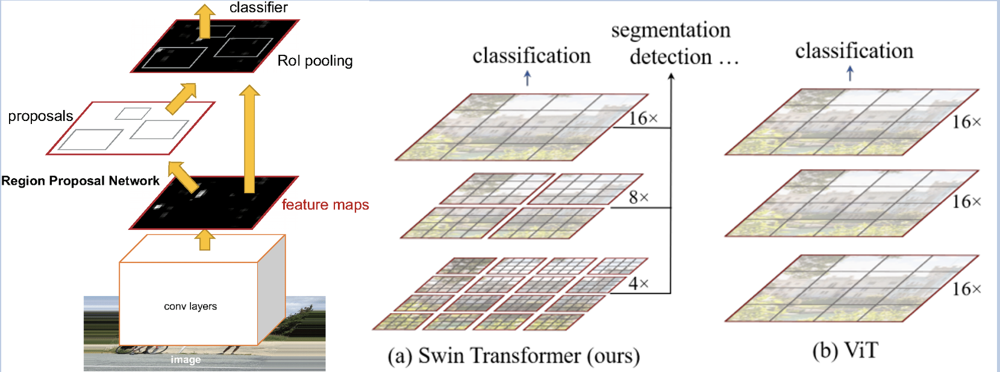

# 모델 설명

## 모델 선정 - 모델 후보

- **모델 후보:** **합성곱 신경망을 사용하는 CNN, Transeformer를 사용한 Swin Transformer,와 ViT(Vistion Transformer).**

## 모델 선정 - 한정된 자원으로 최대의 효율을 내는 모델

- **Confusion matrix를 바탕으로 데이터가 제한될 때, CNN은 Transformer 모델보다 더 우수한 성능을 보여, CNN 모델을 선택.**

## 모델 구조 - Base model

- **한정된 자원 상황에서 성능에 영향을 주는 깊이, 해상도, 너비의 최적 조합을 기반으로 만든 EfficientNet CNN 모델을 사용.**
- **V2를 선택한 이유는 초기 stage에서 depthwise conv 연산 대신 하나의 3x3 conv 연산을 사용한 Fused-MBConv 블럭을 적용하여 정확도와 속도를 향상시켜 세번째 사진처럼 v1보다 모델 선정 기준에 더 부합.**

## 모델 구조 - Hidden layer

- **과적합을 방지하기위해 설정한 확률로 일부 뉴련을 비활성화 하는 Drop out과 연산량을 줄이기위해 GlobalAveragePooling2D을 사용.**
- **Fc 레이어**
    - **보틀넥 피쳐만 추출하여 FC 레이어에 학습시켜 전이학습에 필요한 카테고리를 사용하고, 학습 시간을 단축하며 적은 데이터로도 높은 정확도를 얻기 위해 이 방법을 선택.**
    - **128개의 뉴런을 갖는Dense 레이어로 구현.**

## 모델 구조 - Output layer

- **Predictions layer**
    - **이진분류를 위해 2개의 뉴런으로 구성되어있고 출력값을 해석하기 쉬운 확률의 형태로 변환하기 위해 softmax 활성화 함수를 사용.**
